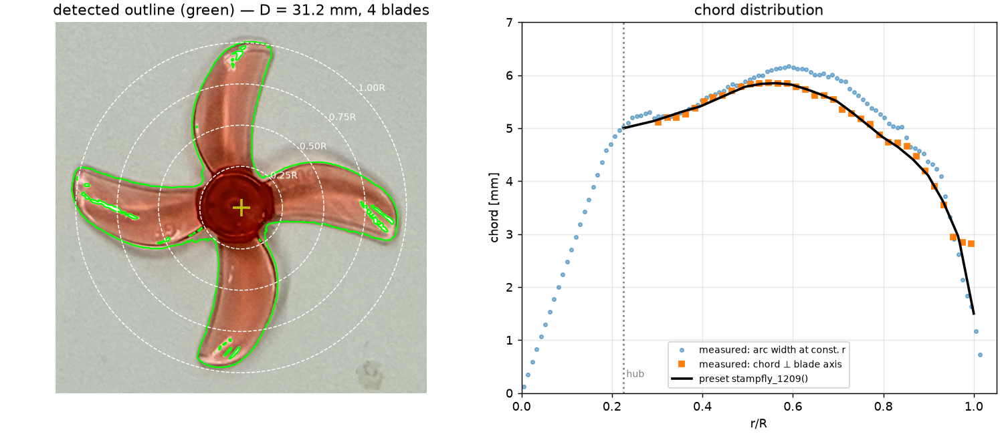

# StampFly 1209 プロペラ (31 mm 4 枚) の形状計測と性能推定

平面形と翼断面をそれぞれ実機の写真から実測し、BEMT で性能を推定した記録。

## 1. 平面形の計測



真上から撮影した写真を、同じ面に置いた金属定規で校正して読み取った。

| 項目 | 値 | 求め方 |
|------|-----|--------|
| 画像スケール | 77.0 px/mm | 定規の cm 目盛り 3 本の間隔 (770 px / 10 mm) |
| 直径 | **31.21 mm** (1.229 in) | 色分割した外形の外周 99.5 パーセンタイル × 2 |
| ブレード枚数 | **4** | 連結成分 |
| ハブ外径 | 7.04 mm (r/R = 0.226) | 方位角被覆率が 93 % を切る半径 |
| 最大コード長 | 5.86 mm @ r/R = 0.55 | 半径ごとの円弧長 × cos(後退角) |
| 投影面積 (4 枚+ハブ) | 292.9 mm² | 面積比 0.383 |
| 翼端後退角 | 34.5° | ブレード中心線の傾き |
| ソリディティ σ | 0.422 | B·c₀.₇₅/(πR) |
| 推定質量 | 0.26 g | 面積 × 板厚 (翼 0.55 mm / ハブ 2.0 mm) × PC 1.20 g/cm³ |
| 極慣性 Jz | 1.67×10⁻⁸ kg m² | 上記質量分布から (= 0.264 m R²) |

**ピッチは写真から読めない。** 型番 "1209" の公称 0.9 inch を幾何ピッチ一定として
与えている (`stampfly_1209(pitch_in=0.9)`)。絶対値が要る場合は静止推力を 1 点測って
`Rotor(collective_deg=...)` を較正するのが最短 (1 deg ≈ 推力 6 %)。

## 2. 空力の特徴

- σ = 0.42 は 2 枚プロペラ (0.10 前後) の 4 倍。**翼素の迎角は 0.75R で 5.8° と低く**、
  低い翼素荷重を枚数で稼ぐ設計。
- 翼端でも **Re = 5×10³ 〜 1.8×10⁴**。翼型ポーラの選び方が結果を支配するため、
  既定で低 Re 用の `LOW_RE_THIN` を使う。
- 翼端 Mach は 40,000 rpm でも 0.19。圧縮性は効かない。

## 4. 静止推力 (BEMT, 海面標準大気)

| rpm | 推力 [gf] | トルク [mN·m] | 軸動力 [W] | Ct | Cp | FM | Re@0.75R | α@0.75R | gf/W |
|-----|-----------|---------------|-----------|-----|-----|-----|---------|---------|------|
| 10,000 | 1.19 | 0.048 | 0.050 | 0.363 | 0.298 | 0.59 | 4,450 | 4.1° | 23.9 |
| 20,000 | 4.88 | 0.179 | 0.375 | 0.371 | 0.279 | 0.65 | 8,910 | 4.0° | 13.0 |
| 30,000 | 11.14 | 0.391 | 1.229 | 0.376 | 0.271 | 0.68 | 13,360 | 3.9° | 9.1 |
| 40,000 | 20.01 | 0.685 | 2.870 | 0.380 | 0.267 | 0.70 | 17,820 | 3.8° | 7.0 |

Ct が 0.38 と大きいのは 4 枚 + 高ソリディティのため (Ct は n²D⁴ 基準なので
枚数の効果が直接効く)。ディスク基準では CT/σ = 0.017 で軽荷重。
翼素の幾何迎角は 0.75R で 3.9° しかないが、キャンバのおかげで
実質 −α₀ = 7.1° 分が上乗せされ cl ≈ 0.9 が出ている。

## 5. ホバー点 (4 発)

| 機体重量 [g] | 1 発 [gf] | 回転数 [rpm] | 軸動力/発 [W] | 合計 [W] |
|-------------|-----------|-------------|--------------|---------|
| 28.0 | 7.00 | 23,870 | 0.63 | 2.51 |
| 32.0 | 8.00 | 25,500 | 0.76 | 3.05 |
| **36.8** | **9.20** | **27,310** | **0.93** | **3.73** |
| 40.0 | 10.00 | 28,450 | 1.05 | 4.21 |
| 45.0 | 11.25 | 30,150 | 1.25 | 4.99 |

## 6. 前進飛行 (27,310 rpm 固定)

流入角 = シャフト軸と進行方向のなす角 (0° = 真上昇、90° = 真横)。

| V [m/s] | 流入角 | J | Fz [gf] | Fx [gf] | Mx [µN·m] | My [µN·m] |
|---------|--------|-----|---------|---------|-----------|-----------|
| 0 | – | 0 | 9.20 | 0 | 0 | 0 |
| 4 | 0° | 0.282 | 7.43 | 0 | 0 | 0 |
| 4 | 60° | 0.141 | 8.68 | −0.44 | −112 | −58 |
| 4 | 90° | 0 | 9.52 | −0.48 | −119 | −87 |
| 8 | 0° | 0.563 | 4.96 | 0 | 0 | 0 |
| 8 | 60° | 0.282 | 8.26 | −0.92 | −243 | −63 |
| 8 | 90° | 0 | 10.12 | −0.93 | −265 | −76 |

- 真上昇 8 m/s で推力が **半分近く**まで落ちる (J = 0.56)。
- 横進では逆に推力が増える (並進揚力)。
- ハブモーメントは 8 m/s で 0.25 mN·m = **空力トルクの 0.8 倍**に達する。
  4 発合わせると機体のピッチモーメントとして無視できない。

## 7. 6 分力計測の要求仕様 (ホバー点)

| 項目 | 値 |
|------|-----|
| 1/rev | 455 Hz |
| **BPF (4/rev)** | **1,821 Hz** |
| 8/rev | 3,641 Hz |
| 推力 | 90.2 mN (9.20 gf) |
| トルク | 326 µN·m |
| 角運動量 Jz·Ω | 47.8 µN·m·s |

**ジャイロモーメント** (機体角速度 q に対する My)

| q [rad/s] | My [µN·m] | 空力トルク比 |
|-----------|-----------|-------------|
| 1 | 48 | 15 % |
| 5 | 239 | 73 % |
| 10 | 478 | **146 %** |
| 20 | 955 | **293 %** |

**質量アンバランスの 1/rev 面内力** (F = m·e·Ω²、m = 0.26 g)

| 重心ずれ | 力 | 推力比 |
|---------|-----|-------|
| 1 µm | 2.1 mN | 2 % |
| 5 µm | 10.6 mN | 12 % |
| 10 µm | 21.3 mN | **24 %** |
| 30 µm | 63.8 mN | **71 %** |

**ロードセル共振の影響** (真値に対する BPF 成分の計測倍率、ζ = 0.02、BPF ≈ 1.8〜2 kHz)

| 固有振動数 | BPF の何倍 | BPF 振幅の計測倍率 | 平均値の誤差 |
|-----------|-----------|------------------|------------|
| 1,000 Hz | 0.5 | ×6.2 | +0.3 % |
| 1,500 Hz | 0.7 | ×9.8 | +0.3 % |
| 3,000 Hz | 1.4 | ×4.6 | +0.3 % |
| 6,000 Hz | 2.9 | ×1.0 | +0.3 % |

### 試験計画への示唆

1. **定常値 (推力・トルク) は普通のロードセルで測れる**。共振があっても
   平均値の誤差は 0.3 % 程度。
2. **動的 6 分力は治具剛性が全て**。BPF が 2 kHz なので、一般的な 6 軸
   ロードセル (fn = 1〜2 kHz) では BPF 成分が 5〜10 倍に増幅されて出る。
   fn > 6 kHz の治具にするか、伝達関数で逆補正する。
3. **アンバランスが空力の 1/rev より桁違いに大きい**。ホバー点で空力起因の
   BPF 成分は 0.08 mN しかないのに対し、重心ずれ 5 µm で 14 mN。
   空力を見たいなら事前のバランス取りが必須。
4. **定格の選定**: 推力 90 mN、トルク 0.3 mN·m に対し、定格 1 N / 20 mN·m 級を
   選んでも 16 bit A/D では BPF 成分 (0.08 mN) が数 LSB しかない。
   専用の低定格センサか、高分解能 (24 bit) の A/D が要る。
5. **ジャイロモーメントの分離**: 機体を振りながら測る動的試験では、
   q = 10 rad/s でジャイロが空力トルクの 2 倍になる。ジャイロ項 Jz·Ω×ω は
   既知なので差し引けるが、そのためには **回転数と機体角速度の同期計測**が要る。

## 8. 実測との突き合わせ (推力試験 1 点)

実測: **Ω = 1209 rad/s (11,545 rpm) で 推力 1.00 gf** (= 9.807 mN, Ct = 0.228)

| | 実測 | モデル (較正前) |
|---|---|---|
| 推力 @11,545 rpm | 1.00 gf | **1.60 gf** |
| Ct | 0.228 | 0.364 |

**モデルが 60 % 過大**。ただしこの作動点は 0.75R で Re = 5,100、翼端で Re = 2,000
しかなく、翼型モデルがもっとも当てにならない領域である。

### 1 点では原因を切り分けられない

`prop_sim.calibration` で 2 つの仮説をそれぞれ較正すると、**どちらもこの
1 点には完全に合う**。

| 仮説 | 較正値 | 残差 |
|------|-------|------|
| 取付角がずれている | `collective = −7.81°` | 0.000 mgf |
| 低 Re で揚力が落ちる | `re_lift = 1.022` | 0.000 mgf |
| キャンバ効率が低い | 0 にしても足りない | 58 mgf |

しかし外挿すると食い違う。

| rpm | Ω [rad/s] | 取付角仮説 [gf] | Re 仮説 [gf] | 食い違い |
|-----|-----------|----------------|-------------|---------|
| 5,000 | 524 | 0.18 | 0.10 | 61 % |
| **11,545** | **1209** | **1.00** | **1.00** | **0 %** |
| 20,000 | 2094 | 3.04 | 4.09 | 30 % |
| 27,300 | 2859 | 5.71 | 8.64 | 43 % |
| 35,000 | 3665 | 9.44 | 15.13 | 49 % |

ホバー (9.2 gf/発) の予測は

| 仮説 | 回転数 | Ω | 軸動力/発 | 4 発合計 |
|------|-------|---|----------|---------|
| 取付角 | 34,570 rpm | 3620 rad/s | 1.047 W | 4.19 W |
| 低 Re | 28,040 rpm | 2936 rad/s | 0.973 W | 3.89 W |

**ホバー回転数が 23 % 不定**。物理的には低 Re 仮説の方が納得しやすいが
(公称 0.9 in のピッチが実質 0.51 in というのは考えにくい)、`re_lift = 1.02`
は「Re が 1 桁下がると揚力がほぼゼロになる」という極端な値でもある。
実際には両方が効いている可能性が高い。

### 次にすべきこと

**回転数を変えた点をあと 2〜3 点測る**。両仮説は較正点から離れるほど
30〜60 % 食い違うので、たとえば 20,000 rpm と 30,000 rpm を測れば決着する。

```python
meas = [ps.ThrustMeasurement(omega=1209.0, thrust_gf=1.00),
        ps.ThrustMeasurement(rpm=20000.0, thrust_gf=...),
        ps.ThrustMeasurement(rpm=30000.0, thrust_gf=...)]
res = ps.calibrate(rotor, ps.BEMT(), meas,
                   parameters=("collective", "re_lift"))
print(res.report())
rotor = res.rotor          # 較正済みロータ
```

3 点あれば取付角と Re 依存性を同時に同定できることは、合成データで検証済み
(`tests/test_calibration.py::test_joint_calibration_recovers_both_parameters`)。
トルクも測れれば `torque_weight` を上げて抗力側も同時に較正できる。

## 9. モデル仮定の感度

`examples/07_stampfly_1209.py` が出力する (36.8 g 機体、1 発 9.20 gf)。

| 仮定 | ホバー回転数 | 軸動力/発 [W] | FM |
|------|-------------|--------------|-----|
| **既定 (実測断面、P = 0.9 in)** | **27,310** | **0.932** | **0.671** |
| 断面: キャンバ効率 0.70 | 28,150 | 0.946 | 0.662 |
| 断面: キャンバ効率 1.00 | 26,560 | 0.924 | 0.677 |
| 断面: 剥離泡ペナルティ 2.2 | 27,370 | 1.009 | 0.620 |
| 断面: 投影補正 厚み ×0.85 | 27,300 | 0.927 | 0.675 |
| 翼型: 汎用の低 Re 薄翼 (断面を使わない) | 31,290 | 0.982 | 0.637 |
| 翼型: 平板 | 32,930 | 1.189 | 0.527 |
| 翼型: 高 Re 相当 (Clark Y) | 27,810 | 0.875 | 0.715 |
| ピッチ P = 0.8 in | 28,540 | 0.933 | 0.671 |
| ピッチ P = 1.0 in | 26,360 | 0.944 | 0.663 |
| 翼端 washout −2° | 28,020 | 0.939 | 0.667 |
| 取付角 −1° | 27,960 | – | – |
| 取付角 +1° | 26,720 | – | – |

**断面写真の効果が大きい。** 翼型を推測していたときはホバー回転数が
27,800〜32,900 rpm (±8 %) に散らばっていたが、断面が実測できたことで
粘性補正係数をどう振っても **26,560〜28,150 rpm (±2.9 %)** に収まる。

残る不確かさの順位は

1. **ピッチ (±0.1 in で ±4 %)** — 写真から読めない唯一の主要量。いまの最大要因。
   断面写真のコード線の傾き (29.6°) は撮影の向きで決まっただけでピッチではない
2. 粘性補正 (キャンバ効率・剥離泡) — ±3 %
3. 形状計測 (直径 ±0.2 mm、断面の投影誤差) — 1 % 未満

したがって次に効くのは**静止推力を 1 点実測して `collective_deg` を較正する**こと
(1° ≈ 推力 6 %、ホバー回転数 600 rpm)。ピッチ分布そのものを知りたい場合は、
**ロータ回転面を基準にした向きで**断面写真を撮り直すか、ブレードを数か所で切って
それぞれの断面の傾きを共通の基準面に対して測るのが確実。
